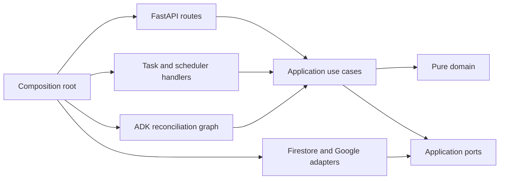
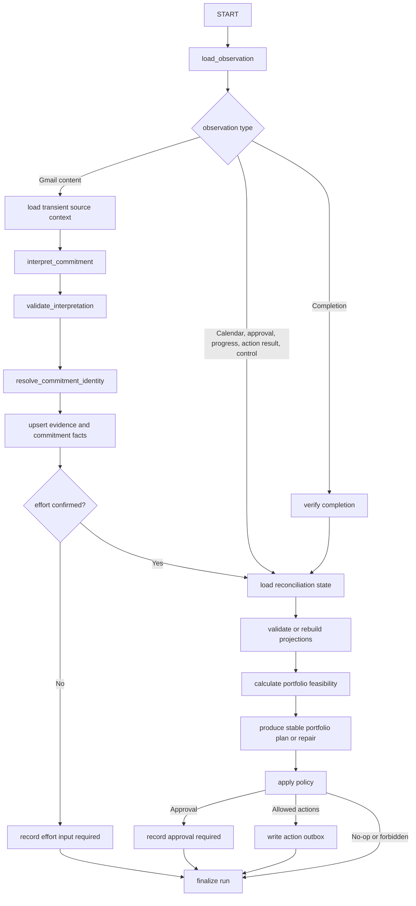

# CommitmentOS P0 Code Architecture

## Implementation Baseline for the All Things Agentic Hackathon

**Status:** Proposed for implementation review  
**Architecture date:** August 10, 2026  
**Product plan:** `CommitmentOS_Build_Plan_Final.md`, Version 5.1  
**Deployment diagram:** `CommitmentOS_P0_Architecture.svg`  
**Primary track:** The Taskmaster

## 1. Purpose and authority

This document translates the locked P0 product and deployment architecture into code boundaries. It defines the repository layout, dependency rules, runtime entry points, message contracts, persistence ownership, reconciliation graph, frontend slices, and test structure that development must follow.

The artifacts have this precedence:

1. `CommitmentOS_Build_Plan_Final.md` controls product behavior, scope, acceptance criteria, and the implementation schedule.
2. This document controls code organization and module ownership.
3. `CommitmentOS_P0_Architecture.svg` controls the high-level deployment and trust-boundary presentation.

If implementation pressure exposes a conflict, do not silently bypass an invariant. Record the issue and resolve it explicitly before changing one of these artifacts.

## 2. Architectural decisions

P0 is a modular monolith deployed as one container on one Cloud Run service. It contains several HTTP entry points and bounded workers, but it is not a collection of independently deployed microservices.

The implementation follows these decisions:

- **Hexagonal dependency direction:** domain code knows nothing about FastAPI, Firestore, Google APIs, Cloud Tasks, or React.
- **Durable continuation:** every asynchronous transition is represented by a Firestore record before a Cloud Task is dispatched.
- **One observation, one bounded reconciliation run:** an ADK run consumes a durable observation and terminates after recording a durable outcome.
- **Separate read and write capabilities:** reconciliation can read Calendar state but cannot receive a Calendar mutation client. Only the action executor receives the write capability.
- **Deterministic authority:** identity validation, lifecycle changes, progress, capacity, scheduling, risk, policy, idempotency, revisions, and mutation eligibility remain deterministic.
- **Narrow model authority:** Gemini interprets human language and creates schema-bound proposals. It never chooses or executes an external mutation.
- **Facts before projections:** immutable or revisioned facts are committed first. Replaceable projections always carry their complete input revisions and algorithm version.
- **At-least-once transport:** Pub/Sub, Cloud Tasks, webhooks, and scheduled recovery may repeat. Domain outcomes converge through deterministic document IDs, idempotency keys, leases, and revision checks.
- **Explicit transport ownership:** Pub/Sub carries Gmail watch notifications only. Cloud Tasks carries source synchronization, normalized-observation reconciliation, and Calendar-action execution.
- **No durable FastAPI background work:** `BackgroundTasks`, in-memory queues, and process-local schedulers must not be used for work that must survive a Cloud Run recycle.
- **Same-origin UI:** the compiled React application and FastAPI API share one origin and one server-side authenticated session.

## 3. Dependency map



Allowed imports:

- `domain` may import only the Python standard library and the approved validation library.
- `application` may import `domain`, application DTOs, and port protocols.
- `workflows` may import `application`, `domain`, and workflow contracts, but not concrete Google or Firestore adapters.
- `infrastructure` may import application ports and shared contracts to implement them.
- `api` may import application use cases and API contracts, never concrete repositories or Google SDK clients.
- `bootstrap` is the only package allowed to construct concrete adapters and inject them into routes, use cases, and graph nodes.
- `frontend` communicates only through the versioned HTTP API. It never duplicates scheduling, risk, lifecycle, or policy rules.

## 4. Repository layout

```text
commitmentos/
├── README.md
├── AGENTS.md
├── pyproject.toml
├── uv.lock
├── Dockerfile
├── cloudbuild.yaml
├── backend/
│   ├── src/commitmentos/
│   │   ├── __init__.py
│   │   ├── main.py
│   │   ├── bootstrap/
│   │   │   ├── container.py
│   │   │   ├── settings.py
│   │   │   └── logging.py
│   │   ├── api/
│   │   │   ├── middleware/
│   │   │   │   ├── request_context.py
│   │   │   │   ├── security_headers.py
│   │   │   │   └── error_mapping.py
│   │   │   ├── dependencies/
│   │   │   │   ├── controlled_session.py
│   │   │   │   ├── csrf.py
│   │   │   │   ├── google_oidc.py
│   │   │   │   └── calendar_channel.py
│   │   │   ├── routers/
│   │   │   │   ├── auth.py
│   │   │   │   ├── dashboard.py
│   │   │   │   ├── commitments.py
│   │   │   │   ├── approvals.py
│   │   │   │   ├── controls.py
│   │   │   │   ├── pubsub.py
│   │   │   │   ├── calendar_webhook.py
│   │   │   │   ├── task_handlers.py
│   │   │   │   ├── scheduler.py
│   │   │   │   ├── demo.py
│   │   │   │   └── health.py
│   │   │   └── schemas/
│   │   ├── application/
│   │   │   ├── commands/
│   │   │   │   ├── receive_gmail_signal.py
│   │   │   │   ├── receive_calendar_signal.py
│   │   │   │   ├── synchronize_source.py
│   │   │   │   ├── reconcile_observation.py
│   │   │   │   ├── resolve_approval.py
│   │   │   │   ├── record_work_check_in.py
│   │   │   │   ├── complete_commitment.py
│   │   │   │   ├── change_system_control.py
│   │   │   │   ├── execute_calendar_action.py
│   │   │   │   └── run_maintenance.py
│   │   │   ├── queries/
│   │   │   │   ├── get_today.py
│   │   │   │   ├── get_commitment.py
│   │   │   │   ├── list_commitments.py
│   │   │   │   ├── list_activity.py
│   │   │   │   └── get_system_status.py
│   │   │   ├── services/
│   │   │   │   ├── observation_dispatcher.py
│   │   │   │   ├── outbox_dispatcher.py
│   │   │   │   ├── source_sync_dispatcher.py
│   │   │   │   └── projection_guard.py
│   │   │   ├── dto/
│   │   │   └── ports/
│   │   │       ├── unit_of_work.py
│   │   │       ├── repositories.py
│   │   │       ├── gmail_reader.py
│   │   │       ├── calendar_reader.py
│   │   │       ├── calendar_writer.py
│   │   │       ├── model_interpreter.py
│   │   │       ├── task_dispatcher.py
│   │   │       ├── identity_verifier.py
│   │   │       ├── clock.py
│   │   │       └── id_generator.py
│   │   ├── domain/
│   │   │   ├── shared/
│   │   │   ├── commitments/
│   │   │   ├── evidence/
│   │   │   ├── progress/
│   │   │   ├── planning/
│   │   │   ├── policy/
│   │   │   ├── controls/
│   │   │   ├── actions/
│   │   │   └── audit/
│   │   ├── workflows/
│   │   │   └── reconciliation/
│   │   │       ├── graph.py
│   │   │       ├── state.py
│   │   │       ├── routes.py
│   │   │       └── nodes/
│   │   ├── contracts/
│   │   │   ├── observations.py
│   │   │   ├── tasks.py
│   │   │   ├── model_output.py
│   │   │   └── versions.py
│   │   ├── infrastructure/
│   │   │   ├── firestore/
│   │   │   │   ├── client.py
│   │   │   │   ├── unit_of_work.py
│   │   │   │   ├── repositories/
│   │   │   │   ├── serializers/
│   │   │   │   └── indexes.py
│   │   │   ├── google/
│   │   │   │   ├── gmail_reader.py
│   │   │   │   ├── calendar_reader.py
│   │   │   │   ├── calendar_writer.py
│   │   │   │   ├── gemini_interpreter.py
│   │   │   │   ├── oauth_client.py
│   │   │   │   └── oidc_verifier.py
│   │   │   ├── messaging/
│   │   │   │   ├── cloud_tasks.py
│   │   │   │   └── pubsub.py
│   │   │   └── demo/
│   │   │       └── read_model.py
│   │   ├── prompts/
│   │   │   ├── commitment_interpretation_v1.md
│   │   │   └── explanation_v1.md
│   │   └── demo_data/
│   │       ├── today.json
│   │       ├── commitments.json
│   │       └── activity.json
│   └── tests/
│       ├── unit/
│       ├── contract/
│       ├── integration/
│       └── fixtures/
├── frontend/
│   ├── package.json
│   ├── package-lock.json
│   ├── vite.config.ts
│   └── src/
│       ├── app/
│       ├── api/
│       ├── auth/
│       ├── components/
│       └── features/
│           ├── today/
│           ├── commitments/
│           ├── activity/
│           ├── approvals/
│           └── controls/
├── tests/
│   ├── e2e/
│   ├── fault_injection/
│   └── golden_path/
├── infra/
│   ├── terraform/
│   └── firestore/
│       ├── indexes.json
│       └── rules.txt
├── scripts/
│   ├── configure_workspace_watches.py
│   ├── seed_demo.py
│   ├── reset_controlled_account.py
│   └── run_golden_path.py
└── docs/
    ├── architecture/
    └── adr/
```

`AGENTS.md` should summarize the locked invariants for future coding sessions. It must point back to the full build plan and this document rather than duplicating their details.

## 5. Backend layers

### 5.1 Domain

The domain package owns business meaning and deterministic calculations.

| Module | Ownership |
|---|---|
| `commitments` | Commitment aggregate, lifecycle transitions, ownership, deadline, revision rules, identity operations |
| `evidence` | Source references, source-span keys, provenance, confidence, evidence validation |
| `progress` | Work-block state transitions, check-ins, verified minutes, terminal completion invariant |
| `planning` | Busy-interval arithmetic, candidate slots, portfolio allocation, risk, stable repair, plan diff |
| `policy` | Automatic, approval-required, and forbidden decisions with versioned reasons |
| `controls` | Monitoring mode, automatic-action mode, monotonic control epoch |
| `actions` | Intended Calendar mutations, stable external identity, outbox and execution states |
| `audit` | Machine-readable activity event types and safe display payloads |

Domain services must be pure whenever possible. In particular, the portfolio planner must accept an immutable input snapshot and return an immutable plan result without reading Firestore, Calendar, the clock, or configuration implicitly.

### 5.2 Application

Application commands coordinate transactions and ports. They decide when to call pure domain services, when to commit, and which durable work should be dispatched after commit.

Rules for application code:

- Never make a network call inside a Firestore transaction callback.
- Never dispatch a Cloud Task before its source record commits.
- Use compare-and-set revisions for every consequential mutation.
- Store an activity event in the same transaction as the business decision it describes.
- Treat task dispatch as repairable. A committed record with `dispatch_status=pending` is valid durable work.
- Pass IDs and versions between use cases rather than live SDK objects.

### 5.3 Ports and adapters

External capabilities are split by authority:

- `GmailReader`: history, thread, and message reads only.
- `CalendarReader`: incremental sync, event lookup, and free/busy reads.
- `CalendarWriter`: insert-or-adopt, conditionally patch, and conditionally cancel owned events. Patch and cancellation commands require `expected_observed_etag` and the adapter must send it as `If-Match`. The port returns typed applied, precondition-failed, retryable-failure, and terminal-failure outcomes. It is injected exclusively into `execute_calendar_action`.
- `ModelInterpreter`: schema-bound interpretation and explanation calls.
- `TaskDispatcher`: named Cloud Task creation.
- `IdentityVerifier`: Google ID-token verification for trusted delivery routes.
- `UnitOfWork`: transaction-scoped repositories and compare-and-set commits.

The reconciliation graph must not be constructed with `CalendarWriter`. This is a code-level enforcement of the no-direct-mutation rule.

The writer contract makes Calendar concurrency behavior non-optional:

```text
insert_or_adopt_owned(stable_event_id, owned_event_body)
  -> Applied | AlreadyApplied | RetryableFailure | TerminalFailure

patch_owned(calendar_event_id, expected_observed_etag, owned_patch)
  -> Applied | PreconditionFailed | RetryableFailure | TerminalFailure

cancel_owned(calendar_event_id, expected_observed_etag)
  -> Applied | PreconditionFailed | RetryableFailure | TerminalFailure
```

`expected_observed_etag` must come from the authoritative `calendar_event_snapshots.observed_event_etag` read by the planner. It is persisted unchanged on the outbox intent. Patch or cancellation without it is ineligible and must request synchronization rather than perform an unconditional mutation. Insert has no conditional-modification header; its stable client-supplied event ID and private ownership properties provide create idempotency. The concrete adapter may perform a target lookup only for owned-event adoption and crash recovery.

### 5.4 Composition root

`bootstrap/container.py` constructs production or test adapters once per Cloud Run instance and exposes dependency providers. It may cache thread-safe Google clients, but no correctness decision may depend on process-local state.

The container exposes distinct capability bundles:

- `DashboardCapabilities`: query services and controlled-user commands.
- `SyncCapabilities`: Gmail/Calendar readers, sync repositories, and observation dispatcher.
- `ReconciliationCapabilities`: observation repositories, a read-only `GmailReader` for bounded transient source context, Gemini interpreter, deterministic services, approval/outbox writers, and no Calendar writer.
- `ExecutionCapabilities`: outbox repository, controls, Calendar writer, audit, and observation dispatcher.
- `MaintenanceCapabilities`: watch renewal, cursor recovery, and pending-dispatch scanners.

## 6. HTTP route and trust architecture

Cloud Run permits public IAM-edge invocation because Calendar must reach a public webhook. FastAPI applies a mandatory trust dependency to every route group.

| Route group | Example path | Trust contract | Permitted effect |
|---|---|---|---|
| Health | `/health/live` | Public, no state | Process status only |
| OAuth initiation | `/auth/login` | Exact redirect allowlist; create one-time state, nonce, and PKCE transaction | Start controlled-account authorization only |
| OAuth callback | `/auth/callback` | One-time state/nonce/PKCE verification plus controlled identity allowlist | Create one server-side session only |
| Authenticated auth mutation | `/api/v1/auth/logout`, `/api/v1/auth/revoke` | Allowlisted session plus CSRF; developer authorization for credential revocation | Revoke session or controlled P0 credential |
| Controlled app | `/api/v1/*` | Server-side allowlisted session plus CSRF for mutations | User-scoped reads and structured commands |
| Gmail push | `/internal/pubsub/gmail` | Google OIDC, exact audience, exact push identity | Persist/coalesce Gmail sync request only |
| Cloud Tasks | `/internal/tasks/*` | Google OIDC, exact audience, exact task identity | Run the named bounded job only |
| Scheduler | `/internal/scheduler/*` | Google OIDC, exact scheduler identity | Scan/renew and enqueue bounded work |
| Calendar webhook | `/hooks/google/calendar` | Exact method, empty body, constant-time token check, channel/resource mapping, channel state, valid-signal rate limit | Persist/coalesce Calendar sync request only |
| Judge demo | `/demo/api/v1/*` | Public read-only adapter | Return repository-owned seeded JSON only |

Security rules:

- A router cannot be registered without a declared trust dependency.
- CORS is disabled because the application is same-origin.
- Mutations require a CSRF token and an expected domain revision where applicable.
- OAuth state and nonce records are single-use and expire; callback replay cannot create a second session. Session cookies are host-scoped, `Secure`, `HttpOnly`, and `SameSite=Lax`, and contain no OAuth token.
- Pub/Sub, Cloud Tasks, and Scheduler identities are independently configurable and verified.
- Calendar notification headers are never treated as event contents or mutation instructions.
- Invalid Calendar webhook calls cannot create Firestore work or call a Google API.
- A valid Calendar signal is rate-limited by a Firestore fixed window keyed by a hash of the validated channel ID. It can cause only an authenticated Calendar fetch.
- Request logs exclude authorization headers, cookies, channel tokens, OAuth data, email bodies, and model prompts.

## 7. Durable queues and message contracts

P0 uses three Cloud Tasks queues.

| Queue | Task | Consumer | Concurrency rule |
|---|---|---|---|
| `source-sync` | `SourceSyncTaskV1` | `synchronize_source` | One controlled-user sync at a time, reinforced by a Firestore lease |
| `reconciliation` | `ReconcileObservationTaskV1` | `reconcile_observation` | One controlled-user run at a time in P0; monitoring-mode claim and revision guards remain authoritative |
| `calendar-actions` | `ExecuteCalendarActionTaskV1` | `execute_calendar_action` | Named tasks, revision guards, and two-stage control-epoch claim/preflight |

Cloud Scheduler invokes bounded maintenance routes. Maintenance may renew watches, create recovery sync requests, enqueue undispatched observations, enqueue eligible outbox actions, and create periodic safety observations.

Task payloads contain references, never source bodies, access tokens, Calendar event bodies, or model prompts.

```text
SourceSyncTaskV1
  schema_version
  sync_request_id
  sync_generation_id
  page_sequence
  source                 gmail | calendar
  user_id
  trace_id

ReconcileObservationTaskV1
  schema_version
  observation_id
  workflow_version
  dispatch_generation
  trace_id

ExecuteCalendarActionTaskV1
  schema_version
  outbox_id
  action_idempotency_key
  trace_id
```

Task names are a transport deduplication aid. Firestore IDs and transaction checks remain the product-level idempotency mechanism. Cloud Tasks may retain a completed task name for up to 24 hours, so a reconciliation task name includes `observation_id`, `workflow_version`, and `dispatch_generation`. Holding and later redispatching the same immutable observation increments `dispatch_generation`, avoiding collision with the acknowledged pre-pause task name while preserving one logical reconciliation-run identity. A source-sync task name includes `sync_generation_id` and `page_sequence`; retries reuse the page identity, while continuation uses a new page sequence.

This is the authoritative P0 transport decision: Pub/Sub ends after authenticated Gmail signal ingestion. All durable post-ingress work—including source fetching, normalized-observation reconciliation, and Calendar execution—uses the three Cloud Tasks queues above. No normalized observation is delivered through Pub/Sub.

## 8. Runtime flows

### 8.1 Gmail or Calendar observation

```mermaid
sequenceDiagram
    participant Signal as Pub/Sub or Calendar webhook
    participant API as Trusted ingress route
    participant DB as Firestore
    participant SyncQ as Source-sync queue
    participant Sync as Synchronization command
    participant GoogleAPI as Gmail or Calendar API
    participant RecQ as Reconciliation queue
    participant ADK as Bounded ADK graph

    Signal->>API: Change signal
    API->>DB: Commit/coalesce sync request
    API->>SyncQ: Create named task after commit
    SyncQ->>Sync: OIDC task delivery
    Sync->>DB: Acquire source lease
    Sync->>GoogleAPI: Fetch one bounded provider page
    GoogleAPI-->>Sync: Source records + next page or candidate cursor
    Sync->>DB: Stage bounded generation items + page checkpoint
    Note over Sync,DB: Continue with a new named page task; active cursor is unchanged
    Sync->>DB: Publish completed generation + promote candidate cursor
    alt observation_mode enabled
        Sync->>RecQ: Enqueue observation IDs
        RecQ->>DB: Claim observation after control check
        DB-->>RecQ: processing
        RecQ->>ADK: Process one durable observation
        ADK->>DB: Commit decision and durable outcome
    else observation_mode paused
        Sync->>DB: Mark reconciliation held_by_control
    end
```

If any post-commit enqueue fails, maintenance finds the pending dispatch record and creates the same named task.

Each source-sync invocation fetches at most one provider page and commits only bounded chunks. The synchronization generation protocol in Section 11.5 is mandatory for incremental sync, expired-cursor recovery, and full resynchronization; a provider's candidate cursor or sync token never becomes authoritative merely because its final page was fetched.

Monitoring pause stops new reconciliation work, not source capture. Gmail and Calendar delivery routes, watch renewal, incremental synchronization, cursor advancement, and immutable observation normalization continue while `observation_mode=paused`. This prevents source cursors from expiring or accumulating an unbounded remote gap while guaranteeing that no new Gemini call, identity resolution, planning run, policy decision, or outbox intent starts from those observations.

Before an ADK graph starts, the reconciliation task performs a Firestore claim transaction over the observation, reconciliation run, and current `system_controls` record:

- If monitoring is enabled and the task's `dispatch_generation` is current, the transaction changes the observation from `queued` or `retryable_failed` to `processing` and stores the claimed control epoch.
- If monitoring is paused, the transaction changes the observation to `held_by_control`, stores `held_control_epoch`, acknowledges the Cloud Task, and does not construct or invoke the graph.
- If the generation is stale or the observation is already terminal, the handler acknowledges without work.

A pause that commits after `processing` begins does not cancel that already-started bounded run. The Activity view exposes it as reconciliation in flight. Monitoring pause and automatic-action pause remain independent; pausing monitoring alone does not claim that an already-created Calendar action has been stopped.

Resuming monitoring increments `control_epoch` and creates the normal `system_control_changed` observation. The observation dispatcher then compare-and-sets held observations back to `queued`, increments each `dispatch_generation`, and creates new named reconciliation tasks in stable `observed_at`, then observation-ID order. Every resumed run reloads current facts and revisions. Held observations are never executed from cached graph state, and a failed redispatch remains recoverable through the pending-dispatch scanner.

Gmail message bodies are not placed in task payloads or durable observations. The observation stores the immutable Gmail reference and payload hash. The reconciliation loader fetches the required message or bounded thread context through `GmailReader`, holds it only in invocation memory, sends the minimum required delimited content to Gemini, and persists only the evidence excerpt and structured result. If the source cannot be fetched, the run records a visible retry or reauthorization state rather than using stale cached text.

### 8.2 User approval or progress input

1. The controlled API validates the session, CSRF token, approval state, and expected revision.
2. One Firestore transaction compare-and-sets the decision, records the authoritative fact, appends activity, and creates an observation with pending reconciliation dispatch.
3. The API attempts to enqueue the named reconciliation task.
4. The new ADK run reloads all current facts; it never resumes an old in-memory invocation.
5. If the underlying revision changed, the approval is marked `superseded` and no stale intent executes.

The first plan uses two explicit durable decisions:

1. Confirm or edit the effort estimate.
2. Review and approve the generated initial plan.

The UI may make these steps fast, but it must not silently merge away the initial-plan approval required by policy.

### 8.3 Calendar action

```mermaid
sequenceDiagram
    participant ADK as Reconciliation graph
    participant DB as Firestore
    participant Q as Calendar-actions queue
    participant EX as Calendar executor
    participant CAL as Calendar API
    participant VERIFY as Calendar watch and sync path
    participant SQ as Source-sync queue
    participant RQ as Reconciliation queue

    ADK->>DB: Commit desired state + outbox intent
    ADK->>Q: Enqueue named action task
    Q->>EX: OIDC task delivery
    EX->>DB: Initial claim using revisions + control epoch
    DB-->>EX: claimed with fenced lease; still stoppable
    EX->>DB: Final pre-I/O transaction rechecks revisions + controls
    alt paused, stale, or superseded
        DB-->>EX: held_by_control, stale, or superseded
        EX-->>Q: Acknowledge without Calendar mutation
    else eligible
        DB-->>EX: action_in_flight
        Note over EX,DB: This transition is the external-I/O linearization point
        EX->>CAL: Insert/adopt, or patch/cancel with If-Match
        CAL-->>EX: API response or error
        alt 412 Precondition Failed
            EX->>DB: Mark stale_precondition + commit/coalesce Calendar sync request
            EX->>SQ: Enqueue named Calendar synchronization task
            EX-->>Q: Acknowledge; never retry with a newer etag
        else Terminal outcome: success or terminal failure
            EX->>DB: Commit terminal outcome + idempotent action_result observation
            EX->>RQ: Enqueue follow-up reconciliation
        else Retryable failure
            EX->>DB: Commit retry state and attempt metadata only
            EX-->>Q: Return retryable task response; do not emit action_result
        end
        opt Calendar accepted a mutation
            CAL-->>VERIFY: Independent change notification
            VERIFY->>DB: Commit fetched authoritative Calendar observation
            VERIFY->>RQ: Enqueue fetched observation for reconciliation
        end
    end
```

The executor uses two transactions. The initial claim verifies target revisions, projection provenance, automatic-action mode, control epoch, and an expiring fenced claim lease, then changes `pending` or `retryable_failed` to `claimed`. `claimed` is preparation state and remains stoppable. Immediately before mutation, the final pre-I/O transaction rechecks the same target revisions and current `system_controls`, then changes `claimed` to exactly one of `held_by_control`, `stale`, `superseded`, or `action_in_flight`.

The `claimed -> action_in_flight` transaction is the external-I/O linearization point. A concurrent pause therefore has a deterministic ordering:

- If pause commits before final preflight, the transaction observes the new mode or epoch and changes `claimed -> held_by_control`; no Calendar mutation occurs.
- If final preflight commits first, the action is `action_in_flight` and the executor crosses directly into the Calendar request; pause records that the request can no longer be canceled atomically.

The final preflight also compares the outbox's `expected_observed_etag` with the current authoritative snapshot. A mismatch before I/O changes `claimed -> stale` and requests synchronization. For patch and cancellation, the concrete writer sends the same etag as `If-Match`. A Calendar `412 Precondition Failed` changes `action_in_flight -> stale_precondition`, records safe activity and the failed precondition, commits or coalesces a Calendar sync request, and acknowledges the action task. It does not retry with a freshly fetched etag, does not emit `action_result`, and does not overwrite the intervening user edit. Reconciliation resumes only from the independently synchronized Calendar observation.

If a worker dies while `claimed`, a retry may take over only after the fenced claim lease expires; it still performs the final preflight. If a worker dies after `action_in_flight`, the retry first inspects the persisted stable Calendar event ID and latest independently synchronized Calendar state. It records a matching owned result or moves the action through retryable recovery before attempting the same identity again.

The executor's API-returned event representation is durable mutation evidence, not independent verification of external truth. Only the Calendar synchronization path publishes the authoritative observed Calendar snapshot used to verify desired versus actual state. A retryable API error updates attempt state and remains eligible for Cloud Tasks retry; it does not create `action_result` or reconciliation work. A 412 is not a retryable infrastructure error: the old intent is stale and source synchronization is the only continuation.

### 8.4 Manual completion

Manual completion is authoritative and terminal. The completion transaction writes evidence, `completed_at`, the new commitment revision, and an observation. Reconciliation then creates cancellation intents for every not-started future app-owned work block. Those cancellation actions remain valid even though the commitment is terminal; creation or movement actions for a completed commitment are superseded.

Completed and already-started blocks remain audit facts. Verified minutes are never fabricated to match the original estimate.

## 9. Reconciliation graph

### 9.1 Graph state

Graph state is an invocation-local typed object containing references and validated intermediate results:

```text
ReconciliationStateV1
  run_id
  observation_id
  observation_type
  user_id
  trace_id
  workflow_version
  transient_source_context
  interpretation_proposal
  identity_resolution
  expected_revisions
  execution_control_snapshot
  portfolio_snapshot
  planner_result
  policy_result
  durable_outcome_ids
```

`transient_source_context` is excluded from serialization, logs, activity payloads, and model audit metadata. The persisted audit records model ID, prompt version, schema version, latency, token usage, confidence, and evidence references—not the complete email body.

`execution_control_snapshot` contains `observation_mode`, `automatic_action_mode`, and the exact `control_epoch` read by `load_reconciliation_state`. Policy evaluation uses that snapshot, and every resulting outbox intent persists its epoch. A separate pre-graph claim has already proven that this reconciliation run started while monitoring was enabled. For Calendar mutation, the executor performs both an initial claim and a second transaction immediately before I/O; graph state never substitutes for either execution-time guard.

### 9.2 Routing



### 9.3 Node contract

Each node must:

- Accept and return a declared typed value.
- Be individually unit-testable.
- Use an application port rather than a concrete adapter.
- Record a typed safe failure instead of returning partially valid output.
- Avoid external mutation.
- Avoid waiting for a user or another invocation.
- Check the run's workflow/schema version before consuming stored intermediate data.

Model output is always parsed through `CommitmentInterpretationV1`, then passed through deterministic validation. Unknown fields are rejected. Confidence does not grant authority; uncertain ownership, deadline, or identity routes to confirmation.

## 10. Deterministic planning package

`domain/planning` is organized as pure stages:

```text
planning/
├── intervals.py          # timezone-aware half-open interval operations
├── constraints.py        # hard-constraint checks
├── candidate_slots.py    # fixed-grid free-slot generation
├── scoring.py            # stable documented soft-preference score
├── portfolio.py          # one allocation across all commitments
├── risk.py               # shortfall, buffer, thresholds, risk transition
├── repair.py             # preservation and minimal-displacement objective
├── diff.py               # desired blocks to intended mutations
└── models.py             # immutable planner input/output types
```

Required properties:

- All internal times are timezone-aware instants; display conversion happens at boundaries.
- Candidate intervals are half-open `[start, end)` to avoid boundary overlaps.
- Ordering always ends with stable IDs as tie-breakers.
- Existing valid approved blocks are reserved before new allocation.
- A candidate minute can be allocated only once in one planner run.
- The plan result includes every input revision, planner version, constraint version, and score version.
- Repair produces a diff; it never mutates Calendar.
- A no-feasible-plan result is a successful deterministic outcome, not an exception.

Planner configuration lives in versioned code or checked-in configuration and is written into `planner_runs`. User preferences such as working hours live in Firestore as authoritative user facts.

## 11. Firestore architecture

### 11.1 Collections

P0 uses top-level collections with `user_id` fields and deterministic document IDs where idempotency requires them.

| Collection | Writer | Notes |
|---|---|---|
| `users` | Controlled setup/auth | User timezone, working preferences, allowlist identity |
| `commitments` | Reconciliation commands | Revisioned authoritative facts plus provenance-bearing read projection |
| `work_blocks` | Planner/progress commands | Stable block and Calendar identities, desired schedule, progress facts |
| `source_observations` | Sync/user/action-result commands | Immutable source facts plus reconciliation status, dispatch generation, and control-hold metadata |
| `evidence` | Reconciliation | Deterministic source-span identity and minimal excerpt |
| `approvals` | Reconciliation and controlled API | Compare-and-set decision state |
| `action_outbox` | Reconciliation, dispatcher, executor | Separate dispatch/execution state machines; patch/cancel intent includes `expected_observed_etag` |
| `activity_events` | All business commands | Append-only safe audit data |
| `sync_requests` | Delivery routes and maintenance | Durable/coalesced change signals before generation creation and task dispatch |
| `sync_cursors` | Synchronization commands | Only published Gmail/Calendar cursors, active generation/barrier state, and monotonic `calendar_state_revision` |
| `sync_generations` | Synchronization commands | Base cursor revision, fenced lease, mode, aggregate page/item counts and manifest hashes, candidate cursor, status, and publication metadata |
| `sync_generation_items` | Synchronization commands | Deterministic, bounded staging records for normalized observations and Calendar snapshot candidates |
| `calendar_event_snapshots` | Calendar synchronization | Current provenance-carrying projection for app-owned and unrelated events, including tombstones |
| `processing_leases` | Sync, reconciliation, and executor commands | Expiring ownership with fencing token |
| `web_sessions` | Auth commands | Hash of opaque session ID, CSRF secret, expiry, revocation |
| `planner_runs` | Reconciliation | Immutable input revisions, allocation, risk, versions |
| `reconciliation_runs` | Reconciliation | Observation/workflow identity, status, attempt, durable outcomes |
| `system_controls` | Controlled API | Modes and monotonic epoch |
| `calendar_channels` | Watch renewal | Hashed token material, channel/resource mapping, overlap state |

### 11.2 Document identities

```text
observation_id       = sha256(canonical_encode(
                         "observation:v1", observation_type,
                         producer_id, producer_version))
evidence_id          = sha256(canonical_encode(
                         "evidence:v1", observation_id, source_span_key))
outbox_id            = sha256(canonical_encode(
                         "outbox:v1", action_idempotency_key))
reconciliation_run   = sha256(canonical_encode(
                         "reconciliation:v1", observation_id,
                         workflow_version))
sync_generation_id   = sha256(canonical_encode(
                         "sync-generation:v1", source, user_id,
                         base_cursor_revision, generation_number))
sync_generation_item = sha256(canonical_encode(
                         "sync-generation-item:v1", sync_generation_id,
                         external_id, external_version))
calendar_snapshot_id = sha256(canonical_encode(
                         "calendar-snapshot:v1", calendar_id,
                         calendar_event_id))
calendar_event_id    = lower_unpadded_base32hex(
                         sha256(canonical_encode(
                           "commitmentos:v1", calendar_id, work_block_id)))
```

Every deterministic ID uses length-delimited canonical encoding rather than ambiguous string concatenation. The observation producer mapping is part of `ObservationV1` and is fixed as follows:

| Observation type | `producer_id` | `producer_version` |
|---|---|---|
| Gmail message or thread change | Controlled user plus immutable Gmail message ID | Immutable payload hash associated with the fetched history record |
| Calendar event change | Calendar ID plus Calendar event ID | Event etag, or a canonical tombstone version for deletion |
| `action_result` | Outbox ID | Terminal execution revision; retry attempts never create a version |
| `approval_resolved` | Approval ID | Compare-and-set decision revision |
| Work check-in | Client-generated idempotency key | Committed check-in revision |
| Manual completion | Client-generated idempotency key | Committed completion revision |
| Control change | Controlled user ID | Monotonic `control_epoch` |
| Periodic safety observation | Controlled user ID | Canonical UTC schedule bucket |

`observation_type` is always included so two producers cannot collide across domains. A task retry reuses the same producer tuple. The persisted Calendar event ID never includes a revision, action type, retry count, or scheduled time.

### 11.3 Write ownership

Every field has one logical owner even if several use cases share a repository.

| State | Logical writer |
|---|---|
| Commitment semantics and lifecycle | Reconciliation/explicit controlled-user command |
| Evidence | Reconciliation identity/evidence stage |
| Confirmed effort | Approval resolution |
| Desired work-block schedule | Committed planner result |
| Outbox `expected_observed_etag` | Policy-approved reconciliation; copied from the authoritative Calendar snapshot and immutable for that intent |
| `mutation_response_*` fields, external ID, and `mutation_response_etag` | Calendar executor; provisional mutation evidence on the outbox result only |
| `observed_*` fields, `observed_event_etag`, and tombstone state | Calendar synchronization command; authoritative current projection in `calendar_event_snapshots` |
| Verified minutes | Work check-in command |
| Completion evidence | Completion command |
| Projection | Versioned portfolio planner publication |
| Outbox intent | Policy-approved reconciliation |
| Outbox dispatch status | Outbox dispatcher |
| Outbox execution status | Calendar executor |
| Sync cursor | Source synchronization command |
| Execution-control epoch | Controlled-user control command |

### 11.4 Transaction boundaries

Important atomic commits:

- Synchronization-generation creation plus its base published cursor revision and fenced lease.
- One bounded staging/apply chunk plus its generation checkpoint; no provider cursor advancement.
- Completed-generation publication: verify every page/apply checkpoint and fencing token, promote the candidate source cursor, increment `calendar_state_revision` for Calendar, mark the generation published, and clear the publication barrier.
- Commitment/work-block changes plus the triggering fact and activity event.
- Projection publication plus complete expected-revision verification.
- Approved initial-plan continuation: verify the prior approval and all current revisions, then atomically commit desired work blocks and outbox intent.
- Outbox intent plus policy/audit record.
- Reconciliation claim/hold plus observation mode, dispatch generation, and reconciliation-run state.
- Executor initial `claimed` transition plus control-epoch, target-revision, projection, and fenced-lease verification.
- Executor final `claimed -> action_in_flight|held_by_control|stale|superseded` pre-I/O transition after re-reading the same guards.
- Terminal external result plus outbox outcome, API-returned event representation, activity, and one idempotent `action_result` observation.
- Retryable external failure plus attempt metadata and retry state, without an `action_result` observation or reconciliation dispatch.
- Calendar `412` plus `stale_precondition`, activity, and a durable/coalesced Calendar sync request, without `action_result` or a blind mutation retry.
- Approval decision plus authoritative fact and continuation observation.
- System-control change plus epoch increment, activity, and control-change observation.

External API calls occur before or after these transactions, never inside them.

### 11.5 Bounded synchronization generations

No Gmail or Calendar synchronization may assume that one provider page fits in one Firestore transaction. The implementation counts every document write and field transform and applies configurable safety budgets below Firestore's platform ceilings. The initial P0 budgets are at most 400 write operations and an estimated 8 MiB of request/index mutation data per transaction, leaving margin below the 500-write and 10 MiB request limits. A changed resource can consume several writes, so page size is derived from the write budget rather than equated with it.

Every incremental or full synchronization uses this protocol:

1. In a transaction, create one `sync_generation` from the current published cursor revision, acquire a fenced source lease, and record `status=staging`, `page_sequence=0`, and the provider request parameters. A coalesced signal cannot start a second generation for the same source and user.
2. A named `SourceSyncTaskV1` fetches at most one provider page outside Firestore. It normalizes that page into deterministic `sync_generation_items` and commits them in bounded chunks. Only after all chunks for the page exist does a small transaction advance the generation's page checkpoint, aggregate item count and manifest hash, and next page token.
3. A continuation task uses a new `page_sequence`. A retry of the same page reuses deterministic item IDs and the same page sequence. The last page stores the provider's `candidate_next_cursor` or `candidate_next_sync_token` on the generation but does not update `sync_cursors`.
4. After every page is staged, the generation enters `applying`. The first apply transaction sets `sync_cursors.publish_in_progress_generation_id`, which blocks planner publication and Calendar executor preflight from consuming a partially applied snapshot. Bounded apply transactions then materialize immutable source observations and, for Calendar, `calendar_event_snapshots`, transactionally advancing aggregate applied counts and hashes after each chunk.
5. A Calendar full resynchronization stages a complete generation without deleting the old published snapshot first. During the bounded apply phase it marks present events and writes tombstones for previously current events absent from the completed generation. A `410 Gone` marks Calendar state `full_resync_required`; planning or mutation based on that Calendar is ineligible until the replacement generation publishes.
6. Each checkpoint transaction maintains bounded aggregate counts and manifest hashes on the generation. One final small transaction verifies the fencing token, `status=ready_to_publish`, matching staged/applied counts and hashes, completed full-sync tombstoning where applicable, and no outstanding chunk. It does not read an unbounded checkpoint set. It then promotes the candidate cursor, increments `calendar_state_revision` exactly once for Calendar, marks the generation `published`, and clears the publication barrier. This is the only transaction that makes a new provider cursor authoritative.
7. Reconciliation dispatchers release the published generation's observations in bounded batches. They never dispatch observations from `staging` or `applying` generations. Failed dispatch remains repairable through generation and observation status scans.

If a worker dies, Cloud Tasks retries the same page or apply checkpoint. A recovery worker may take over only after the fenced lease expires; every checkpoint write verifies the new fencing token. The previously published cursor remains unchanged until final publication, and abandoned staging records are ignored and later garbage-collected. No generation is published merely because its final provider page was fetched.

### 11.6 Current Calendar state

`calendar_event_snapshots` is the only current Calendar representation consumed by portfolio capacity, desired-versus-actual comparison, user-edit classification, and external verification. It is a replaceable projection of the latest independently synchronized Calendar truth; immutable Calendar observations remain its provenance.

Each document is keyed by `calendar_snapshot_id` and contains only the fields required for P0:

```text
calendar_snapshot_id
user_id
calendar_id
calendar_event_id
calendar_state_revision
observed_event_etag
observed_status
observed_start
observed_end
observed_timezone
observed_all_day
observed_transparency
observed_recurring_event_id
observed_original_start_time
observed_managed_by
observed_commitment_id
observed_work_block_id
observed_plan_revision
observed_payload_hash
source_observation_id
observed_at
is_tombstone
deleted_at
```

Unrelated events and CommitmentOS-owned events use the same projection. A canceled or deleted event remains as a tombstone so replay cannot resurrect stale busy time. Recurring instances are represented by their instance event ID plus original start time within the planning horizon.

The bounded Calendar publication protocol materializes every changed snapshot document and immutable observation before the final generation transaction advances the sync cursor and increments `calendar_state_revision`. The planner loads the published revision and relevant snapshot documents through one consistent Firestore read, derives busy half-open intervals deterministically, and records both `calendar_state_revision` and a canonical `calendar_snapshot_hash` in the planner run. Projection publication and outbox creation fail if that revision changed or a Calendar publication barrier is active.

Executor response evidence is stored on the outbox result with unmistakably provisional names such as `mutation_response_etag`, `mutation_response_payload_hash`, `mutation_response_status`, and `mutation_response_received_at`. It never writes `observed_event_etag` and never updates `calendar_event_snapshots`.

A successful action whose matching snapshot has not arrived is `external_verification_pending`. Reconciliation does not issue a duplicate mutation while the successful outbox result awaits observation. The independent watch/sync path, or a bounded safety synchronization after a verification timeout, must publish the matching snapshot or a visible verification failure. Work blocks reference their snapshot by ID; any denormalized observed fields on a work-block read model carry `calendar_state_revision` and are never authoritative.

## 12. Outbox state machines

Keep transport dispatch and business execution separate.

```text
dispatch_status:
  pending -> queued
  pending -> held_by_control
  queued  -> delivered
  held_by_control -> superseded

execution_status:
  pending -> claimed
  retryable_failed -> claimed
  pending -> held_by_control
  claimed -> claimed                   # fenced lease takeover after expiry
  claimed -> held_by_control
  claimed -> stale|superseded
  claimed -> action_in_flight          # final pre-I/O linearization point
  action_in_flight -> succeeded
  action_in_flight -> retryable_failed
  action_in_flight -> terminal_failed
  action_in_flight -> stale_precondition # Calendar 412; request sync, no blind retry
  pending|retryable_failed|held_by_control -> stale|superseded
```

On automatic-action resume, held outbox records are not changed directly to queued. A control-change observation triggers reconciliation, which either supersedes old intent or writes current intent with the new epoch. This differs intentionally from monitoring resume: immutable held observations are safe to redispatch because every resumed run reloads current facts and can produce only revision-checked new intent.

Observation facts are immutable, but their reconciliation envelope has a durable state machine:

```text
reconciliation_status:
  pending -> queued
  pending|queued|retryable_failed -> held_by_control
  queued|retryable_failed -> processing
  processing -> processing             # fenced takeover after processing lease expiry
  processing -> processed|ignored|rejected
  processing -> retryable_failed
  held_by_control -> queued            # resume dispatcher increments generation
```

The `queued|retryable_failed -> processing` transaction is the start boundary for monitoring pause. It reads `system_controls`, verifies `dispatch_generation`, and writes the claimed control epoch plus an expiring processing lease and fencing token. A run already in `processing` is allowed to terminate safely after a later pause; no new run can cross this boundary until monitoring resumes. If its worker dies, a Cloud Tasks retry may take over only after lease expiry, increments the attempt and fencing token, and reruns from current durable facts. Every reconciliation outcome transaction verifies that token, so a late original worker cannot commit after takeover.

## 13. Frontend architecture

The dashboard is a thin client around server-owned business state.

### 13.1 Feature slices

- `today`: outcome strip, today's blocks, candidates, risks, pending decisions, execution status.
- `commitments`: list/detail, evidence, allocation, work blocks, progress, completion.
- `activity`: typed timeline with before/after and failure states.
- `approvals`: effort, initial plan, exceptional repair, and deleted-block decisions.
- `controls`: monitoring and automatic-action modes, separately labeled held-observation, reconciliation-in-flight, held-action, and action-in-flight counts.

### 13.2 Client rules

- Generate TypeScript API types from the backend OpenAPI schema.
- Keep server IDs and revisions in every mutation payload.
- Do not implement risk, scheduling, lifecycle, policy, or idempotency decisions in TypeScript.
- Avoid optimistic updates for approvals, completion, and controls. Show a pending state until the server returns the committed revision.
- Poll read endpoints during P0 rather than introducing WebSockets. Use a faster interval while a repair/action is active and a slower interval at rest.
- Render known failure states explicitly; never replace them with a generic on-track display.
- `/demo` uses a separate read-only API client and never renders live mutation controls.

## 14. Configuration and versioning

`bootstrap/settings.py` validates all environment configuration at startup. Required configuration includes:

- Environment and service base URL
- Controlled user ID/email and IANA timezone
- Google Cloud project, region, queue names, and Pub/Sub resources
- Exact OIDC audiences and permitted service-account identities
- Secret Manager references for OAuth and Gemini credentials
- Gemini model ID
- Prompt, extraction schema, workflow, planner, risk, policy, and event-ID algorithm versions
- Calendar webhook path and protected channel configuration
- Demo mode and live-mode guards

The P0 model is the stable Gemini API model `gemini-3.5-flash`. The model name remains centralized in settings and is still written into every model-backed audit event; it must not be scattered as string literals across graph nodes.

Pin exact Python and JavaScript dependencies in lockfiles. The architecture permits ADK 2.x, but the first successful Phase 0 spike selects and locks one exact patch version.

Every model-backed activity event records:

- Model ID
- Prompt version
- Input/output schema version
- Thinking configuration
- Latency and token usage
- Validation result
- Evidence references

Prompts treat source text as delimited untrusted data and contain no credentials or unrelated mailbox context.

## 15. Observability and error handling

Application logs are structured JSON with:

```text
severity
event_name
trace_id
user_id_hash
observation_id
reconciliation_run_id
planner_run_id
outbox_id
attempt
latency_ms
error_code
```

Business audit and operational logs are separate:

- `activity_events` explain product decisions to the user and judges.
- Cloud Logging explains request, task, dependency, retry, and latency behavior to operators.

Error classification:

- **Retryable infrastructure:** return a retryable task response after recording attempt metadata.
- **Invalid model or source data:** record a safe terminal rejection and acknowledge the task so it does not loop.
- **Stale revision or projection:** record stale/superseded, acknowledge, and enqueue current reconciliation where required.
- **Calendar precondition failure:** on `412`, mark the intent `stale_precondition`, acknowledge the action task, and durably request Calendar synchronization; never retry with a replacement etag.
- **Incomplete source generation:** keep the published cursor unchanged, retain or recover the fenced generation checkpoint, and block consumers only while its apply/publication barrier is active.
- **Authentication failure:** reject before business code and do not create durable work.
- **Reauthorization required:** persist the visible source state and stop dependent work.
- **No feasible plan:** persist a valid domain outcome requiring user attention.

## 16. Test architecture

### 16.1 Unit tests

Pure, fast tests cover:

- Commitment lifecycle and completion invariants
- Identity-operation validation and source-span idempotency
- Typed observation identity mapping and canonical encoding
- Deadline/timezone normalization
- Work-block progress transitions
- Interval arithmetic and hard constraints
- Portfolio single-allocation property
- Stable ordering and deterministic replay
- Minimal-change repair objective
- Risk thresholds and projection provenance
- Autonomy policy and execution-control rules
- Stable Calendar event-ID derivation

### 16.2 Contract tests

- Gemini structured-output schema and rejected unknown fields
- Prompt fixtures, including injection attempts
- Cloud Task envelope versions and deterministic names
- Pub/Sub envelope decoding
- Calendar webhook header validation
- For every Pub/Sub, Cloud Tasks, and Scheduler route: validly signed OIDC with an incorrect audience, and validly signed OIDC with an incorrect service identity, is rejected before durable work
- Every controlled mutation rejects missing and invalid CSRF tokens
- OAuth state and nonce are single-use; missing, mismatched, expired, and replayed values cannot create a session
- Session expiry and revocation are enforced, and the session cookie is `Secure`, `HttpOnly`, `SameSite=Lax`, host-scoped, and contains no OAuth token
- Calendar writer patch/cancel requests include the exact `If-Match` value and map HTTP 412 to typed `PreconditionFailed`
- Firestore serialization round trips
- OpenAPI schema and generated TypeScript client compatibility

### 16.3 Integration tests

Use the Firestore emulator and fake Google adapters to cover:

- Bounded source pages never exceed configured write/byte budgets; staged pages do not advance the published cursor
- The final generation publication promotes the candidate cursor only after every page and apply checkpoint is complete
- Calendar `410` recovery stages a full replacement, writes missing-event tombstones in bounded chunks, and leaves the old cursor non-authoritative until final publication
- Concurrent sync lease behavior
- Approval compare-and-set
- Projection publication revision guard
- Outbox write-before-enqueue recovery
- Initial action claim remains stoppable and cannot call Calendar
- Pause between initial claim and final preflight changes `claimed -> held_by_control` with no Calendar mutation
- Final preflight racing with pause has one deterministic winner at the `action_in_flight` linearization point
- Result plus action-result observation commit
- Retryable Calendar failure records attempt state without creating `action_result` or reconciliation work
- Calendar patch/cancel `412` changes the outbox to `stale_precondition`, creates one repairable Calendar sync request, acknowledges the task, emits no `action_result`, and never retries with a newer etag
- Source synchronization continues while monitoring is paused, advances cursors, and stores observations as `held_by_control` without invoking ADK
- A reconciliation task queued before monitoring pause holds durably when delivered and acknowledges without invoking ADK
- Monitoring resume increments dispatch generation and processes each held observation once from current Firestore state
- A reconciliation already in `processing` may finish after monitoring pause while no new run starts
- Executor `mutation_response_etag` remains distinct from `observed_event_etag` in the authoritative Calendar snapshot
- Unrelated Calendar events, app-owned events, recurring instances, and deletion tombstones reduce into the current snapshot projection
- Planner publication rejects a changed `calendar_state_revision` and records the canonical snapshot hash
- Reconciliation worker death in `processing` permits one fenced takeover after lease expiry; a late original worker cannot commit
- Executor death while `action_in_flight` converges by stable-ID lookup or synchronized truth without an unconditional patch/cancel or duplicate create
- Replay and create-before-record recovery
- Demo/live repository isolation

Opt-in live smoke tests use only the controlled Gmail/Calendar account. They are never required for ordinary unit or CI runs.

### 16.4 End-to-end and fault-injection tests

- Browser tests for Today, Commitments, Activity, approvals, completion, and controls.
- Golden multi-message Gmail fixture through conflict, minimal repair, audit, and completion.
- Replayed Pub/Sub, webhook, task, approval, and result deliveries.
- Process recycle after observation, approval, outbox, API mutation, and result stages.
- Kill a reconciliation worker after `processing` claim and verify retry from durable facts with one committed outcome.
- Kill an executor immediately after `action_in_flight`, both before and after the Calendar response, and verify safe convergence without overwriting an intervening edit.
- Automatic-action pause before claim, between claim and final preflight, and after `action_in_flight`.
- Monitoring pause before source delivery, after reconciliation task enqueue, and after reconciliation enters `processing`, followed by safe held-observation redispatch on resume.
- Calendar cursor invalidation and Gmail watch expiration.
- Projection corruption and concurrent progress updates.
- Attempt every production mutation method and path through `/demo`, and attempt live mutation endpoints using only demo context; every request is rejected with zero Firestore writes, task dispatches, OAuth access, or Calendar calls.
- Ten consecutive golden runs with measured acceptance output.

All external adapters have deterministic fakes. Tests must not monkeypatch domain logic to manufacture a passing golden path.

## 17. Cloud resources and service identities

Infrastructure code defines:

- One Cloud Run service and one runtime service account
- Firestore database and indexes
- Gmail Pub/Sub topic and authenticated push subscription
- Source-sync, reconciliation, and Calendar-action queues
- Scheduler jobs for watch renewal, cursor catch-up, pending dispatch, and safety reconciliation
- Secret Manager secrets
- Minimal IAM bindings for task creation, task invocation, scheduler invocation, Pub/Sub invocation, Firestore access, and secret access

Use distinct invoking identities for Pub/Sub, Cloud Tasks, and Scheduler even though they target the same Cloud Run service. The runtime service account receives only the outbound permissions it needs.

The Dockerfile is multi-stage:

1. Build the React application.
2. Install the locked Python runtime dependencies.
3. Copy compiled static assets and backend source into a non-root runtime image.
4. Start one production ASGI server on the Cloud Run `PORT`.

Infrastructure provisioning must not store the controlled account refresh token in Terraform state. OAuth credentials and the P0 refresh token are inserted directly into Secret Manager through the documented controlled setup process.

## 18. Implementation sequence

The repository should be scaffolded in this order, matching the build-plan gates:

1. **Foundation:** package layout, settings, composition root, trust dependencies, health routes, fake adapters, CI, and container build.
2. **Durable contracts:** domain models, observation/task contracts, Firestore unit of work, deterministic IDs, Calendar snapshots, observation hold/resume, activity, controls, approvals, and the two-stage action outbox.
3. **Seeded vertical slice:** one seeded observation through ADK, plan, approval, outbox, authenticated task, Calendar fake/controlled event, result, and follow-up reconciliation.
4. **Source ingestion:** Gmail and Calendar watches, durable sync requests, bounded staging generations, fenced leases, cursor publication, normalization, and recovery.
5. **Semantic interpretation:** Gemini schema, prompts, validation, identity resolution, and evidence.
6. **Portfolio planning:** progress, capacity, risk, first plan, stable IDs, and projection publication.
7. **Continuous repair:** Calendar synchronization, user edit classification, minimal repair, pause claim, and stale-intent handling.
8. **UI and hardening:** three views, failure states, completion cleanup, evaluation fixtures, golden runs, and competition assets.

Do not create Canvas, Drive, email sending, sent-email completion inference, dependencies, multimodal input, multi-account abstractions, a general chat surface, or a persistent ADK session store during this sequence.

## 19. P0 code-review invariants

Every pull request or implementation batch must be rejected if it introduces any of the following:

- A Calendar API mutation outside `execute_calendar_action` and its concrete writer adapter
- An unconditional Calendar patch or cancellation, or one whose `If-Match` value does not equal the outbox's persisted `expected_observed_etag`
- An external call inside a Firestore transaction
- A business-critical FastAPI background task or process-local queue
- A task payload containing email text, OAuth material, secrets, or full Calendar data
- A model output applied without strict parsing and deterministic validation
- A planner or policy decision based on a stale projection
- A Calendar event ID containing a plan revision or scheduled time
- A first Calendar plan created without confirmed effort and explicit plan approval
- Progress inferred from elapsed Calendar time
- A completed commitment reopened by projection logic
- A held action released directly after resume without reconciliation
- A Calendar mutation executed from `claimed` without a successful final `claimed -> action_in_flight` transaction
- A new reconciliation run entering `processing` while monitoring is paused
- A held observation redispatched without a new dispatch generation and a fresh control check
- A Calendar webhook that starts reconciliation or mutation directly
- A retryable Calendar action failure that creates an `action_result` observation or reconciliation task
- A Calendar 412 that is retried with a new etag, emits `action_result`, or fails to request authoritative synchronization
- An executor mutation response treated as an independently verified Calendar observation
- A planner or desired-versus-actual comparison that treats `mutation_response_*` fields as current Calendar state
- A source cursor promoted before every page and apply checkpoint in its fenced synchronization generation is complete
- A synchronization transaction that exceeds the configured write/byte safety budget or treats provider page size as Firestore write count
- A Calendar planner or executor consuming snapshots while `publish_in_progress_generation_id` is set
- A normalized observation delivered through Pub/Sub instead of the reconciliation Cloud Tasks queue
- A reconciliation outcome committed without the current processing fencing token
- A deterministic document ID built through ad hoc string concatenation instead of typed canonical encoding
- A frontend implementation of server-owned business rules
- Live mailbox data or mutation endpoints reachable from judge demo mode
- Any `/demo` request capable of writing Firestore, dispatching a task, using live OAuth credentials, or calling Calendar
- P1 code before the P0 hard gate passes

## 20. Definition of code-architecture readiness

The P0 code architecture is ready to implement when:

- The build plan remains the accepted behavioral source of truth.
- The three Cloud Tasks queue contracts, task names, dispatch generations, and Pub/Sub's Gmail-signal-only role are agreed.
- The route trust matrix is agreed.
- The Firestore collections, document IDs, and write ownership are agreed.
- The typed observation-producer mapping and terminal-only `action_result` contract are agreed.
- Executor mutation evidence and independently synchronized Calendar truth have separate collections, field names, and ownership.
- The two-stage `pending|retryable_failed -> claimed -> action_in_flight` protocol and final pre-I/O linearization point are accepted.
- `expected_observed_etag`, mandatory `If-Match` for patch/cancel, and 412-to-synchronization behavior are accepted as part of the Calendar writer port.
- Monitoring pause keeps source synchronization active, durably holds reconciliation, and safely redispatches observations with a new generation after resume.
- `calendar_event_snapshots`, `calendar_state_revision`, snapshot hashing, and mutation-response separation are accepted as the current Calendar-state contract.
- Bounded synchronization generations, publication barriers, fenced recovery, and final cursor promotion are accepted for incremental and full resynchronization.
- Early-completion cleanup and the two-step first-plan approval are accepted.
- Exact dependency versions and OAuth scopes are selected during the Phase 0 integration spike.

Once accepted, implementation should begin with the repository scaffold and Phase 0 integration-risk spike, not with dashboard polish.
