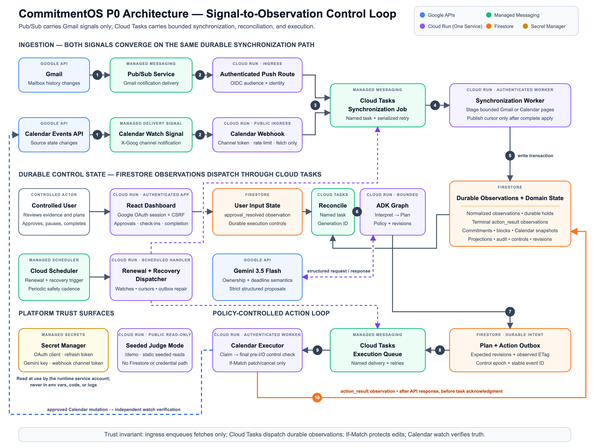

# CommitmentOS

**An evidence-backed, capacity-aware commitment controller.** CommitmentOS
is not an assistant that plans once — it is a controller that keeps a
promise feasible as reality changes, until completion is verified:

> Detect a commitment in Gmail → preserve its evidence and ownership →
> confirm effort → reserve Calendar capacity → observe a conflict →
> reconcile and minimally repair the plan → explain the action → verify
> completion.

Gemini turns human language into clear, evidence-backed proposals. Deterministic, reliable code handles all the important stuff—like figuring out who’s responsible, updating state, handling scheduling limits, enforcing policies, and making calendar changes.

Built for Google's **All Things Agentic Hackathon** (Taskmaster track).

**Measured evidence:** Every performance and reliability claim here links back to the exact Cloud Run revision that produced it in [`docs/proof_index.md`](docs/proof_index.md).

## What it does

- **Watches Your Gmail** for promises you make—like "I'll have it back before our Friday 4 p.m. review." It figures out who owns each commitment, tracks deadlines, and keeps everything tied to the right thread, even if things get restated or deadlines move. You always have one commitment—never duplicates—with exact evidence snippets (and it never stores full message bodies).
- **Reserves real time on your calendar using a deterministic planner.** It splits your shared free time across all your active commitments—working within your hours, block size limits, and daily focus caps. The first plan always asks for your approval.
- **Fixes things automatically** when reality changes. If a meeting gets dropped onto a work block, the system detects it, syncs, classifies the conflict, and makes the smallest possible repair—moving only what’s needed and leaving everything else exactly as it was. On average, these repairs finish in about **9 seconds** (measured across ten live campaign runs).
- **Escalates problems instead of pretending they don't exist.** If a repair would move things too much—like more than 24 hours—it asks for your approval. If something’s impossible or needs reauthorization, every issue is shown clearly in the dashboard—never hidden behind a generic "on track" badge.
- **Tracks real progress**—just letting time pass doesn’t count as work. Only your check-ins add verified minutes, and marking something as done is always a deliberate, final step. The system never makes up minutes to match the original estimate.
- **Explains everything along the way**—a detailed timeline captures every observation, interpretation, policy call, calendar update, and any change in control.

## Architecture



Everything runs as a single Python/FastAPI service on **Cloud Run. The public edge is needed** because Google Calendar has to reach an HTTPS webhook, but every route is locked down with its own trust contract. **Firestore** stores all the important data for good. Pub/Sub only handles Gmail watch notifications. There are three Cloud Tasks queues: one each for syncing sources, reconciling changes, and executing Calendar actions—each handled as a named, idempotent task. **Cloud Scheduler** takes care of renewing watches, catching up cursors, repairing dispatch, and making sure safety reconciliation happens every minute. **Secret Manager** keeps production and sandbox Gemini keys, the OAuth client, and the refresh token for the controlled account separate. The sandbox key comes from a quota project that only serves the public sandbox, so unauthenticated users can't eat up the quota meant for real data.

Each reconciliation run is a tightly controlled **ADK graph call** with two honest stages: first, it runs the durable reconciliation controller; then it finalizes a safe summary of the run. The controller handles everything—interpreting data, tracking identity and evidence, managing your commitments, setting policy, and handling outgoing actions. The ADK graph doesn’t pretend these internal steps are separate nodes. Any changes to your Calendar only happen in a replay-safe Cloud Tasks executor that uses stable, client-chosen event IDs, If-Match checks, and revision guards. Nothing relies on in-memory state—everything, from the dashboard to approvals and results, flows through new, durable records.

| Route class | Trust contract |
|---|---|
| `/app`, `/api/v1/*` | Access is allowed only for users who sign in with Google OAuth and are on the approved account list. Once logged in, you get a secure, server-side session cookie. Every action that changes data must include a special CSRF token for extra protection. |
| `/internal/tasks/*`, `/internal/scheduler/*`, `/internal/pubsub/*` | These internal routes only accept requests carrying Google-signed OIDC tokens. Each token must match the exact intended audience and the correct service account group. Gmail change notifications are strictly rate-limited and stored safely. |
| Calendar webhook | This route is protected by a complex, hard-to-guess channel token that’s checked securely. Each incoming webhook is matched to its correct channel and resource, with status, overlap, and expiry all tracked. Every channel has its own reliable rate limit to prevent abuse. |
| `/demo` | The demo route is strictly read-only. It uses pre-seeded, static data and never connects to Firestore or any credentials. Any attempt to make changes is always rejected. |
| `/sandbox` | The sandbox is fully interactive and intentionally open, with no login required. All its data and every change are kept in memory only, separate from real accounts. The only outside connection is to Gemini, using a special sandbox key and quota. There’s no way to reach production data or credentials. Sessions are identified with explicit headers, not default permissions. You can pick between guided and free-play modes, and there are clear limits on the number of sessions, their lifetime, message length, concurrent use, and more, to keep it safe and fair. |


### Stack

| Component | Choice |
|---|---|
| Model | Gemini `gemini-3.5-flash` via the Gemini API (structured outputs, evidence-quote anchoring, `thinking_level: low`) |
| Agent framework | Google ADK 2.6.3 (Python graph `Workflow`, bounded invocations) |
| Runtime | Python 3.14 + FastAPI on Cloud Run |
| State | Firestore (Native mode) — transactions, composite indexes, fenced leases |
| Transport | Pub/Sub (Gmail push only) + Cloud Tasks ×3 + Cloud Scheduler ×4 |
| Frontend | React 19 + TypeScript + Vite, compiled to static assets served by the same service |

## Judge mode

There are two ways to try CommitmentOS without logging in, and neither one touches any live data. Each is designed for a different purpose: /demo lets you see the exact scenario used to produce the live evidence, while /sandbox lets you use an entirely separate, custom email thread (or just play around freely). This way, both modes prove the system’s claims—without the agent being rigged to a single conversation.

/sandbox — take control and explore. Each time you reset, you can pick between two modes: follow a crafted, end-to-end story, or jump into a free-play email thread where you set the subject. In free play, you can take the role of either Jordan or You, send any messages you want (even several in a row from the same person), and once a commitment is created, you get all the same tools—conflict, time advance, and check-in—that a judge would for a real case. The guided lane walks you through sending a request, accepting it, moving deadlines, scheduling over reserved blocks, letting time pass, and logging your minutes—so you can watch the agent extract, plan, repair, and never fake progress along the way. Everything you see in the right-hand panel is powered by the real production stack—using the same interpreter, identity resolver, planner, policy engine, executor, and audit log as the live system. The public model and key are kept totally separate from production. The world around the agent is simulated: Firestore is just a dictionary, Gmail is a pre-scripted mailbox, Calendar is an in-memory store (with real etag and canceled-event behavior), Cloud Tasks is a list, and you can even advance the clock. Each visitor gets their own private sandbox—sessions are isolated, reading state doesn’t keep them alive, and worlds expire after 45 minutes of inactivity or two hours at most. When a world expires, it’s deleted on schedule so private text isn’t kept longer than needed.

Interpretation is the one part that's live. For guided scenarios, the first time a full thread or candidate comes up, you see real Gemini output, which can be reused from a local cache. If the model is down, or if the output doesn’t match the story’s authored rules, the guide falls back to its recorded interpretation and tells you so. For messages written by judges, it’s different: those always run live, never use the shared cache, and if Gemini is unavailable, you’ll see a custom error—never a canned answer. Custom sources and structured results exist only in your sandbox world until it resets or expires. There are limits on what you can do: up to 1,000 characters per message, 8 messages per session, and 12 requests per minute per instance. There are also caps on session creation, model calls, concurrency, and per-session use. The sandbox is deployed with a ceiling of two instances and its own quota pool. Each Gemini call in the sandbox has a 20-second timeout and no retry unless the model returns a specific error. The extraction model has no tools, and the same deterministic validation is used as in production—evidence quotes must exactly match the original message. The sandbox interpreter and client use a separate API key; production won't start if the keys are misconfigured. The sandbox key must come from a project that’s only used for the sandbox quota.

/demo — read the dashboard. Here, you can see the full dashboard filled with seeded data from a fixed demonstration. This mode is completely read-only: it doesn’t connect to Firestore, credentials, or any Google APIs, and any attempt to change data is blocked immediately. No login is ever needed.

## Repository layout

```
backend/src/commitmentos/   the service: api/ application/ domain/
                            infrastructure/ workflows/ contracts/ bootstrap/
             .../sandbox/    the interactive judge sandbox: the in-memory twin
                            (twin.py), one isolated world composing the real
                            stack over it (world.py), guided card deck and its
                            recorded interpretations (scenario.py), bounded
                            judge-authored messages (session.py/interpreter.py)
backend/tests/              unit + integration + contract suites over an
                            in-memory Firestore twin (production repo code
                            runs unmodified against it)
tests/fault_injection/      §16.4 fault matrix (worker kill, lease takeover,
                            executor death, projection corruption)
tests/golden_path/          local rehearsal of the golden campaign
frontend/                   React dashboard (Today / Commitments / Activity)
                            plus the sandbox view; one bundle serves /app,
                            /demo, and /sandbox
scripts/                    gate drivers, golden campaign, security probes,
                            eval runner, ops helpers
docs/                       phase progress, evidence packs, measured results
infra/firestore/            composite index definitions
Plan_Final/                 the authoritative build plan + architecture
```

## Local spin-up

Prerequisites: Python 3.14, [uv](https://docs.astral.sh/uv/), Node 22+.

```bash
# 1. Backend dependencies
uv sync

# 2. Configuration
cp .env.example .env        # then fill in your project's values
                            # (every variable maps 1:1 to bootstrap/settings.py)

# 3. Tests — 328 tests over the in-memory Firestore twin; no cloud access
uv run pytest

# 4. Frontend
cd frontend && npm ci && npm run build && cd ..

# 5. Run the service (serves API + compiled dashboard).
#    Boot reads the OAuth client secret from Secret Manager (a deliberate
#    fail-fast), so a local run needs Application Default Credentials for
#    the project. On macOS, gRPC's default DNS resolver can fail to reach
#    Google endpoints — use the native resolver:
GRPC_DNS_RESOLVER=native uv run uvicorn --app-dir backend/src \
  commitmentos.main:create_app --factory --port 8080
```

The test suite runs completely in memory, using a Firestore twin—so there’s no cloud access and no credentials needed. To run the service itself (including the demo views with seeded data), you’ll need access to the project’s Secret Manager. If you want to view /demo without any setup, just use the hosted deployment.

Troubleshooting for macOS: Some uv builds accidentally set the hidden file flag on your venv’s .pth files. Starting with Python 3.13, hidden .pth files are silently ignored (you’ll see "Skipping hidden .pth file" in python -v), which can break import commitmentos unless you’re running the uvicorn command above. The --app-dir backend/src flag keeps the server safe from this issue. For other tools, just run chflags nohidden .venv/lib/python*/site-packages/*.pth after syncing.

## Cloud deployment

```bash
# One-time project setup (region us-west1 in this deployment)
gcloud services enable run.googleapis.com cloudbuild.googleapis.com \
  artifactregistry.googleapis.com firestore.googleapis.com \
  cloudtasks.googleapis.com pubsub.googleapis.com \
  cloudscheduler.googleapis.com secretmanager.googleapis.com \
  gmail.googleapis.com calendar-json.googleapis.com

# Firestore (Native), three Cloud Tasks queues, the Gmail watch topic (with
# gmail-api-push@system.gserviceaccount.com granted Publisher), four service
# accounts (runtime, pubsub, tasks, scheduler with run.invoker), and five
# secrets (OAuth client, controlled refresh token, controlled-data Gemini key,
# sandbox-only Gemini key, calendar channel token) — resource names are
# referenced from .env.example. The sandbox key must come from a separate
# Gemini quota project; only its Secret Manager resource belongs here.

# Composite indexes
# (create the definitions in infra/firestore/indexes.json)

# Set COMMITMENTOS_SANDBOX_GEMINI_API_KEY_SECRET_REF in the local .env, then
# use the owner-only release gate. It builds the dashboard/service, deploys
# with affinity and maxScale=2, explicitly routes 100% to latest, and fails if
# Cloud Run or the served custom-message API/UI differs from that contract.
# The deploy path also sends one sandbox-only model probe to prove the new
# secret is accessible and its key works; it never touches controlled data.
.venv/bin/python scripts/deploy_commitmentos.py --deploy

# Read-only repeat of the post-deploy checks.
.venv/bin/python scripts/deploy_commitmentos.py

# Scheduler jobs (dispatch repair, watch renewal, cursor catch-up, safety)
bash scripts/create_scheduler_jobs.sh

# Register the Gmail + Calendar watches with the controlled credential
python scripts/gmail_watch_spike.py register
python scripts/calendar_watch_spike.py register --service-url <SERVICE_URL>
```

Your sandbox world stays with the server instance that created it, so you won’t lose your work even if you restart your browser or your session times out. The system allows only two instances at a time, which helps manage how much public free-play traffic comes in. Cloud Run remains open for Calendar webhooks, but every entry point is locked down with strict access controls. Only the project owner can update deployments or change traffic settings.

The app automatically shuts down when it’s not needed—there’s no need to keep it running after judging. Every piece of evidence in the docs folder comes from live tests on the deployed service. If you want to check any claim, docs/proof_index.md shows exactly which version produced it and links to the supporting files.

Source serialization, cursor recovery, and publication

Gmail Pub/Sub notifications just let the system know there’s been a change—they don’t contain the actual email content. If multiple notifications arrive around the same time, the system merges them and processes only the most recent update. To keep things organized, only one sync job per user can update Gmail data at a time. If the same sync task comes in twice, it’ll just continue from where the last one stopped.

If Gmail history returns a 404, it means the system’s pointer is out of date. When this happens, the sync stops, marks itself for a full resync, and automatically starts a new resync job. It scans only the Inbox and Sent folders. Before it starts, it records the current history ID, so it picks up any new emails that arrive during the scan and nothing slips through the cracks. Calendar sync works the same way, even for deleted events.

Both sources use bounded staging generations:

* Every Cloud Task grabs one page of data at a time. Because each page is standardized and tracked with checkpoints, retries are safe and don’t depend on how long a worker has been running or how the data is split up.
* Each transaction can write up to 400 items or 8 megabytes, as set in the configuration (these are the default values in .env.example). When the system writes data, it works in chunks of up to 100 items and always saves space for transaction overhead before starting.
* As long as a sync job is running, all new data and Calendar snapshots are kept behind a barrier—they’re not published until everything’s complete. This way, reconciliation and planning never use incomplete or half-finished information.
* Once syncing is done, a single transaction makes sure everything lines up, updates the cursor and revision, and lifts the publication barrier. Only then are new observations released in safe, manageable batches. If a crash happens before this, the system just sticks with the last published cursor as the official record.

Authoritative facts versus projections

Some things are always saved as facts—commitments, confirmed effort and deadlines, evidence, work block status, verified minutes, Calendar snapshots, approvals, controls, and outbox records. Others, like portfolio allocation, remaining effort, risk, projected finish, shortfall, and shared buffer, are just projections that can be recalculated at any time. Each projection includes details about its source, such as which commitment revision and work block version it came from. The dashboard shows allocation details only when they’re up to date; if a projection is missing or outdated, it’s marked as unknown and never treated as fact.

Before external I/O, the outbox executor independently reloads authoritative revisions, the execution-control epoch, ownership, and observed Calendar etag. Stable event IDs make create replay-safe; patch/cancel use If-Match, and an HTTP 412 stales the intent and requests a fresh source sync. Action results return as new observations rather than being inferred from queued intent.

Seeded demo, live seed, reset, and evaluation

/demo needs no database seed or reset command. It reads packaged scenario documents from backend/src/commitmentos/demo_data/ through a read-only model with no Firestore or Google credential adapter, so every request starts from the same data and mutations are impossible.

/sandbox needs no seed command either: each session builds its own world in memory and drops it on idle expiry or instance recycle. "Start over" calls the bounded reset endpoint, releasing the old world before opening its replacement. The deployment command requires Cloud Run session affinity because these demonstration worlds are intentionally process-local. The sandbox's behavior is pinned by backend/tests/integration/test_sandbox_flow.py (the story must extract, converge onto one commitment, plan, repair a conflict, and verify honest minutes) and backend/tests/contract/test_sandbox_contracts.py (isolation, sender/text validation, free-play and card caps, serialization, automatic expiry, reset, and route precedence).

For an end-to-end seed against the deployed service and real Calendar, use the audited live driver. Its generated run tag scopes cleanup:

```bash
.venv/bin/python scripts/run_seeded_slice.py run --cleanup
.venv/bin/python scripts/run_seeded_slice.py run --run-tag <tag>
.venv/bin/python scripts/run_seeded_slice.py cleanup --run-tag <tag>
```

For a full controlled-account reset, preview the exact owned events and domain
document counts, then copy the printed revision-bound confirmation phrase:

```bash
.venv/bin/python scripts/reset_controlled_account.py preview
.venv/bin/python scripts/reset_controlled_account.py run \
  --confirm "cleanup <user_id> events=N documents=M"
```

The extraction evaluation calls the pinned production Gemini model, prompt,
wire schema, and deterministic validator. It writes a new result under
`docs/phase2_evidence/`; do not overwrite the recorded evidence pack:

```bash
.venv/bin/python scripts/run_extraction_eval.py
.venv/bin/python scripts/run_extraction_eval.py --limit 5
.venv/bin/python scripts/run_extraction_eval.py --category prompt_injection
```

### Post-audit hardening status

The current source includes a post-campaign hardening pass recorded in
`docs/post_audit_hardening_progress.md`. It removes misleading unused
scaffolding and closes cursor recovery, channel validation, explanation,
reopen/priority, policy, audit, outbox, and failure-state gaps. The immutable
evidence packs still describe the previously deployed revision; this newer
source must pass a fresh owner-run live/security campaign before its results
replace or extend those records.

## OAuth: publishing mode, scopes, limitations

- **Mode:** External / In production / **unverified personal use** — chosen
  after an up-front integration spike proved authorization, refresh, watch renewal,
  revocation, and allowlisting end to end. Refresh tokens do not carry the
  Testing-mode 7-day expiry; the unverified-app warning is acknowledged for
  the single controlled account. This is explicitly **not** a claim of
  public verification or multi-user readiness.
- **Scopes (exactly four):** `openid`, `userinfo.email`,
  `calendar.events` (sensitive), `gmail.readonly` (restricted). No send, no
  modify, no Drive.
- **Access:** the application allowlists a single controlled account; any
  other Google identity completes sign-in and receives `account not allowed`
  with no session. Revocation is grant-wide; the UI surfaces
  `reauth_required` rather than silently using stale data.
- **Testing-mode fallback:** if the consent screen must return to External /
  Testing, treat the restricted-scope refresh token as expiring after seven
  days. Reconnect at least every seven days, immediately before the golden
  campaign, and again before recording:

  ```bash
  .venv/bin/python scripts/oauth_spike.py authorize --mode testing
  .venv/bin/python scripts/oauth_spike.py refresh
  .venv/bin/python scripts/gmail_watch_spike.py register
  .venv/bin/python scripts/calendar_watch_spike.py register --service-url <SERVICE_URL>
  ```

  The authorize command stores the new refresh token in Secret Manager and
  never prints it. In the selected In-production personal-use mode there is
  no seven-day cadence; reconnect is event-driven whenever
  `reauth_required` appears, then renew both watches with the same commands.
- Production multi-tenant token storage is out of scope by design; the
  controlled account's refresh token lives in Secret Manager.

## Evidence and measured results

- **End-to-end campaign:** ten consecutive passing runs of the
  full scenario against the deployed service — live Gemini interpretation
  each run, 61/61 checkpoints, conflict-to-repair 7.2–10.2 s (mean 9.1 s),
  honest verified minutes, byte-identical replay of every observation and
  action. Per-run JSON + summary: `docs/phase5_evidence/`.
- **Extraction evaluation (§16.1):** 32 labeled fixtures across 12
  categories including prompt injection — 100% schema validity, ownership,
  deadline accuracy, and injection containment at ~$0.0008/message:
  `docs/phase2_evidence/`.
- **Live security probes:** session negative matrix, CSRF on every mutation
  route, wrong OIDC audience/identity on all three internal groups, the
  full `/demo` mutation matrix, and the `/sandbox` isolation matrix (no
  session, forged session, off-deck input, cross-session visibility, and
  controlled-identifier leakage) — all green against the deployed revision.
- **Fault injection (§16.4):** worker kill + fenced-lease takeover, executor
  death before/after the Calendar response, create-before-record crash
  convergence, projection corruption blocking stale execution.
- Phase-by-phase gate records with sanitized live evidence:
  `docs/phase*_evidence/`, `docs/Phase_0_Integration_Risk_Spike_Checklist.md`.

## Security and privacy

- Email bodies are processed transiently and never persisted or logged;
  the ledger stores IDs, minimal excerpts, structured fields, and hashes.
- Source text enters the model as delimited untrusted data (with delimiter
  neutralization); the extraction agent has no mutation tools; model output
  must satisfy a strict schema, and evidence quotes must be exact substrings
  of the source — the anti-injection anchor.
- Structured logs pass a redactor (no tokens, cookies, bodies, or addresses);
  verified against live Cloud Logging at every phase gate.
- The executor mutates only events carrying CommitmentOS ownership
  properties, and patch/cancel always sends `If-Match`; a 412 can only mark
  intent stale and trigger resynchronization.
- The interactive sandbox is unauthenticated, so its safety is structural
  rather than procedural: all state and mutation ports are in-memory twins,
  and its session id travels in an explicit header rather than a cookie
  (nothing the browser sends automatically carries authority there). Its one
  external capability is a no-tools model adapter with a separate interpreter,
  client, secret, and quota project; the production container graph and every
  controlled-user credential/document remain unreachable. Free-play text can
  only enter as Jordan or You; length, per-session volume, rolling traffic, and
  the in-memory cache are capped. Arbitrary text never receives a recorded card
  fallback, and all model output still crosses strict schema, evidence-anchor,
  identity, policy, and ownership boundaries before it can mutate even the
  simulated world.

## Known limitations

- Single controlled user and calendar by design for this release; multi-user OAuth
  onboarding, token vaulting, and verification are out of scope.
- Sent-email completion inference is deliberately excluded — completion is
  an explicit user act.
- The unverified-app consent warning is part of the personal-use OAuth mode.
- Canvas, dependencies, follow-up drafts, and other P1+ features are
  documented in the plan but intentionally unbuilt.
